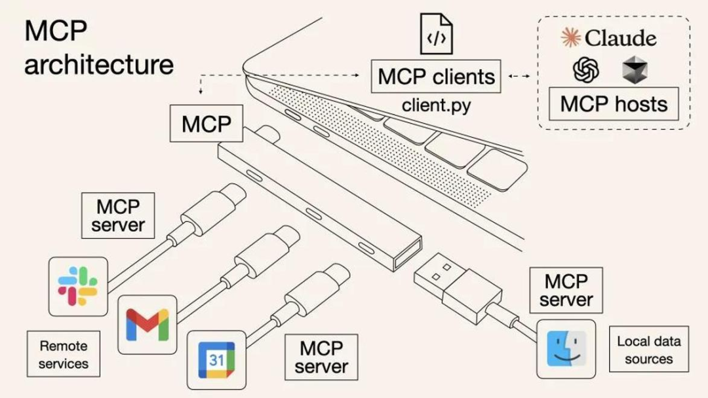

# MCP是个啥
MCP本质上是一个可以跨进程(不限语言,开发好后可以被任意mcp client调用)调用的tool, 是给 Model 扩展 Context 上下文，让它能做的更多，知道的更多的 Protocal 协议。 跨本地的进程调用，就是用 stdio。跨远程的进程调用，就是用 http。

## mcp为什么要分为resource和tool
MCP 把 resource 和 tool 分开，本质上是把「数据/上下文」和「行为/动作」拆成两类不同的能力，原因主要有这几点：

1. 语义职责不同

- Resource：只读的上下文源。比如文件内容、数据库记录、API 返回的数据、文档片段。                                  
  它回答的问题是「模型现在能『看到』什么」。
- Tool：可调用的函数/操作。比如发送邮件、创建工单、执行 SQL、调用外部 API。
  它回答的问题是「模型能『做』什么」。

拆开后，server 暴露的能力表意更清晰，**模型也更容易判断该“读取信息”还是“执行操作”。**

2. 权限与安全模型不同

- Resource 通常只读，副作用小，客户端可以更宽松地让它访问。
- Tool 通常有副作用，可能修改外部状态，客户端往往需要用户确认、权限控制或审计日志。

**分开后，客户端可以对两类能力做不同的授权策略。**

3. 缓存与生命周期不同

- Resource 多数可缓存，客户端能按 URI + scheme 做命中复用，减少重复拉取。
- Tool 调用一般不可缓存，每次调用都是一次独立操作。

4. UI 与交互方式不同

以 Claude Code 为例，MCP server 提供的 tool 会直接出现在模型可调用的工具列表里；而 resource
更多是作为上下文被引用或拉取。分开后 IDE/客户端能给用户更一致的交互体验。

简单记忆

▎ Resource = 给模型看的资料
▎ Tool = 让模型干的事

这样设计既让协议更干净，也方便客户端、server 和模型三方各司其职。
